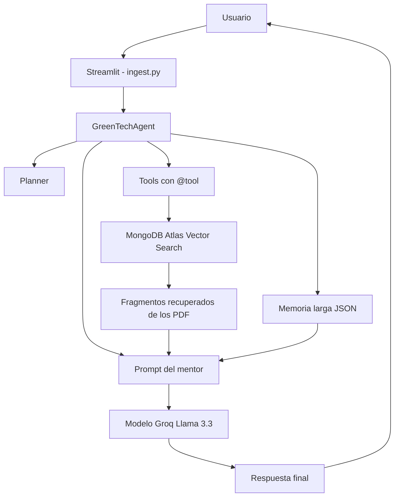

# Mentor IA - GreenTech Project

Este proyecto es un mentor de induccion tecnica para GreenTech. La idea es que
una persona pueda hacer preguntas sobre sistemas fotovoltaicos y recibir una
respuesta basada en los manuales tecnicos del proyecto.

La aplicacion usa RAG, es decir, primero busca informacion relacionada en los
documentos cargados y despues le pasa ese contexto al modelo de lenguaje para
generar la respuesta.

## Que problema intento resolver

En una empresa como GreenTech, una parte importante de la induccion depende de
manuales, protocolos y documentos tecnicos. El problema es que revisar esos PDF
manualmente toma tiempo y no siempre es facil encontrar justo la informacion que
se necesita.

Con este mentor IA puedo consultar esos documentos desde una interfaz simple y
obtener respuestas mas rapidas sobre temas como paneles solares, seguridad,
inversores, baterias y criterios de instalacion.

## Archivos principales

- `ingest.py`: es la aplicacion principal en Streamlit. Aqui esta el chat, la
  conexion con MongoDB Atlas, la busqueda vectorial y la llamada al modelo de
  Groq.
- `src/agent.py`: contiene el agente principal. Recibe la pregunta, pide un plan
  de accion, llama herramientas y devuelve la respuesta.
- `src/planner.py`: clasifica la intencion del usuario antes de responder.
- `src/memory.py`: maneja la memoria larga en un archivo JSON local.
- `src/prompts.py`: centraliza el prompt del mentor y las plantillas usadas para
  respuestas simples, RAG y reportes.
- `src/tools.py`: contiene las herramientas del agente registradas con `@tool`
  de LangChain.
- `load_pdfs.py`: carga los PDF locales en MongoDB Atlas para que despues puedan
  ser consultados por el chat.
- `requirements.txt`: contiene las librerias necesarias para ejecutar el
  proyecto.
- `.env.example`: muestra las variables de entorno que se deben configurar.
- `Dockerfile`: permite levantar la aplicacion usando Docker.
- `manual.pdf`, `Guia_de_instalacion_de_SFD_-_2013.pdf` y
  `guia_evaluacion_sistema_fv.pdf`: son los documentos tecnicos usados como base
  de conocimiento.

## Arquitectura general



## Como funciona

1. El usuario escribe una pregunta en el chat.
2. `ingest.py` envia la pregunta a `GreenTechAgent`.
3. El agente usa `planner.py` para clasificar la intencion.
4. Segun el plan, el agente decide si busca documentos, usa memoria o genera un
   reporte.
5. La funcion `search_documents_tool` busca informacion parecida en MongoDB
   Atlas cuando la consulta lo necesita.
6. El agente arma el prompt con la pregunta, memoria corta, memoria larga y
   contexto recuperado.
7. Groq genera la respuesta final.
8. La respuesta se muestra en pantalla y tambien queda guardada en memoria.

Si la pregunta pide un informe o reporte, se usa `generate_report_tool` para
responder con una estructura mas ordenada.

## Herramientas que deje implementadas

Las herramientas estan en `src/tools.py` y usan el decorador `@tool` de
LangChain. Esto me permite mostrar que el proyecto no solo tiene funciones
sueltas, sino herramientas que pueden ser registradas por un agente.

- `search_documents_tool`: busca informacion tecnica en los documentos cargados.
- `get_memory_tool`: recupera los ultimos mensajes de la conversacion.
- `save_memory_tool`: guarda mensajes del usuario y del asistente en la sesion.
- `generate_report_tool`: genera un reporte breve usando el contexto recuperado.

En `ingest.py` estas herramientas se construyen con `build_tools()` y se usan en
el flujo principal del chat.

## Memoria

El proyecto usa dos tipos de memoria:

- Memoria corta: usa `st.session_state` para mantener el historial mientras la
  aplicacion esta abierta.
- Memoria larga: usa `data/memory/long_term_memory.json` para guardar resumenes
  de interacciones anteriores.

Cuando se presiona `Reiniciar tutoria`, se borra el historial de la sesion.
Eso no borra la memoria larga guardada en JSON.

## Planificacion y decisiones

El archivo `src/planner.py` clasifica cada consulta en una de estas intenciones:

- `consulta_simple`
- `consulta_tecnica`
- `solicitud_reporte`
- `continuidad_contexto`
- `informacion_insuficiente`

Con esa clasificacion, el agente decide que hacer:

- si falta informacion, pide mas detalle;
- si es una consulta simple, responde directo usando memoria;
- si es tecnica, busca documentos antes de responder;
- si pide reporte, usa contexto documental y genera una estructura ejecutiva;
- si depende de algo anterior, incluye memoria corta y memoria larga.

## Recuperacion semantica

Para la recuperacion de contexto uso:

- `HuggingFaceEmbeddings` con el modelo `all-MiniLM-L6-v2`.
- `MongoDBAtlasVectorSearch` como base vectorial.
- Base de datos: `GreenTech_DB`.
- Coleccion: `manuals_vectors`.
- Indice: `vector_index`.

Los PDF no se leen directamente cada vez que se pregunta algo. Primero hay que
cargarlos a MongoDB Atlas con `load_pdfs.py`. Despues el chat consulta esa
coleccion vectorial.

## Variables de entorno

El proyecto necesita un archivo `.env` en la raiz con estas variables:

```env
GROQ_API_KEY=tu_api_key_de_groq
MONGODB_ATLAS_URI=tu_uri_de_mongodb_atlas
```

El archivo `.env` no se sube al repositorio porque contiene credenciales.

## Instalacion local

Desde PowerShell:

```powershell
cd M:\GreenTech_Project
python -m venv venv
.\venv\Scripts\activate
pip install -r requirements.txt
```

Si el entorno virtual ya existe, basta con activarlo:

```powershell
cd M:\GreenTech_Project
.\venv\Scripts\activate
```

## Cargar los PDF en MongoDB Atlas

Antes de usar el chat, hay que cargar los documentos:

```powershell
.\venv\Scripts\python.exe load_pdfs.py --reset
```

Uso `--reset` cuando quiero limpiar la coleccion y volver a cargar los PDF desde
cero.

En mi prueba, el cargador proceso los tres PDF y genero 92 fragmentos en la
coleccion `manuals_vectors`.

## Ejecutar la aplicacion

Con el entorno virtual activado:

```powershell
streamlit run ingest.py
```

Streamlit normalmente abre esta URL:

```text
http://localhost:8501
```

## Ejecutar con Docker

Docker no es obligatorio para probar el proyecto. La forma mas directa es usar
Python y Streamlit. Si quiero correrlo con Docker, primero debo abrir Docker
Desktop y despues ejecutar:

```powershell
docker build -t greentech-mentor .
docker run --env-file .env -p 8501:8501 greentech-mentor
```

## Ejemplos de preguntas

```text
Cuales son las principales medidas de seguridad para instalar paneles fotovoltaicos?
```

```text
Explicame que funcion cumple un inversor en un sistema fotovoltaico.
```

```text
Genera un reporte ejecutivo sobre seguridad en instalaciones fotovoltaicas.
```

## Errores que aparecieron durante la prueba

### 1. La aplicacion abria, pero parecia que no leia los PDF

Al principio el chat se conectaba, pero las respuestas no estaban usando los
documentos. Revise la coleccion `GreenTech_DB.manuals_vectors` y tenia:

```text
document_count = 0
```

Eso significaba que MongoDB Atlas estaba configurado, pero no tenia documentos
vectorizados cargados. La solucion fue crear `load_pdfs.py` y cargar los PDF con:

```powershell
.\venv\Scripts\python.exe load_pdfs.py
```

Despues de eso la coleccion quedo con 92 fragmentos.

### 2. Python no encontraba `dotenv`

Cuando intente revisar MongoDB usando `python` directamente, aparecio este error:

```text
ModuleNotFoundError: No module named 'dotenv'
```

El problema era que estaba usando el Python global y no el entorno virtual del
proyecto. La solucion fue ejecutar los comandos con:

```powershell
.\venv\Scripts\python.exe
```

### 3. Error de DNS al consultar MongoDB Atlas

Tambien aparecio un error de resolucion DNS al intentar conectarme a MongoDB
Atlas desde el entorno restringido:

```text
dns.resolver.LifetimeTimeout
```

La conexion funciono cuando ejecute el diagnostico con permisos de red. En una
ejecucion local normal, esto depende de tener internet, que el URI de MongoDB sea
correcto y que la IP este permitida en MongoDB Atlas.

### 4. Advertencia de Hugging Face

Al cargar los embeddings aparecio esta advertencia:

```text
You are sending unauthenticated requests to the HF Hub
```

No bloquea el funcionamiento. Solo avisa que se esta descargando el modelo sin
token de Hugging Face. Para este proyecto no fue necesario configurar `HF_TOKEN`,
pero podria agregarse si hubiera problemas de limite o descarga.

### 5. Conflicto en README

El README quedo con marcas de conflicto de Git despues de mezclar cambios. Lo
corregi dejando una sola version del documento y eliminando las partes
duplicadas.

## Pruebas manuales

Estas son las pruebas que use para comprobar el funcionamiento:

1. Verifique que MongoDB Atlas tuviera documentos cargados.
2. Ejecute una busqueda semantica de prueba sobre seguridad electrica.
3. Confirme que devolvia fragmentos desde
   `Guia_de_instalacion_de_SFD_-_2013.pdf`.
4. Ejecute la aplicacion con `streamlit run ingest.py`.
5. Probe una pregunta tecnica y una solicitud de reporte.

## Limitaciones actuales

- La memoria larga guarda resumenes simples; no hace todavia una compresion
  avanzada de conversaciones.
- Los PDF deben cargarse antes con `load_pdfs.py`.
- La deteccion de reportes es simple: busca palabras como `reporte`, `informe` o
  `resumen ejecutivo`.
- Aun faltan pruebas automatizadas y documentos tecnicos separados en `docs/`.
