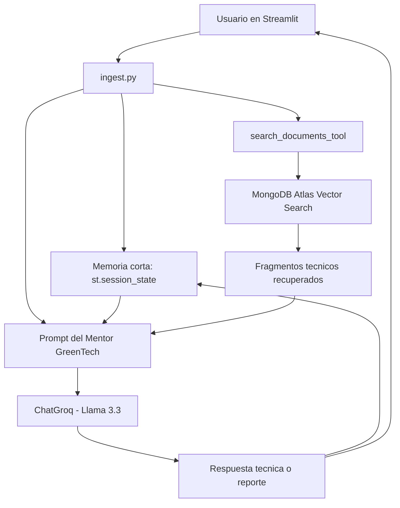

<<<<<<< HEAD
# MENTOR IA - GreenTech Project 🤖🤖

# NOTA: EL PROMPT DEBE SER HECHO EN ESPANOL
=======
# Mentor IA GreenTech
>>>>>>> 51c71b2 (Cambios al Ingestpy ' readme)

Sistema de asistencia inteligente para GreenTech basado en RAG
(`Retrieval-Augmented Generation`). La aplicacion permite consultar manuales
tecnicos de energia solar fotovoltaica usando un modelo de lenguaje de Groq,
embeddings de Hugging Face y busqueda vectorial en MongoDB Atlas.

<<<<<<< HEAD
# Caracteristicas
=======
Este proyecto conserva una estructura simple para que pueda ejecutarse y
evaluarse localmente sin una arquitectura innecesariamente compleja.
>>>>>>> 51c71b2 (Cambios al Ingestpy ' readme)

## Problema que resuelve

<<<<<<< HEAD
# Instrucciones de instalacion y uso
1. **Clonar el repositorio:**
git clone [https://github.com/GKapppa/GreenTech_Project.git](https://github.com/GKapppa/GreenTech_Project.git)

# Levantar docker
**Construir la imagen**
```bash
docker build -t mentoria-greentech .
```

**Ejecutar contenedor**
```bash
docker run -p 8502:8501 --env-file .env mentoria-greentech
```
=======
GreenTech necesita apoyar la induccion tecnica de nuevos integrantes mediante
respuestas consistentes, trazables y basadas en documentacion interna. El mentor
IA ayuda a responder dudas sobre sistemas fotovoltaicos, protocolos de seguridad,
componentes electricos y criterios de instalacion usando manuales cargados en un
vector store.

## Estado actual del proyecto

El proyecto fue mejorado hasta el paso 3 del plan incremental:

1. Se mantuvo la aplicacion actual en `ingest.py`, evitando agregar carpetas o
   componentes nuevos.
2. Se ordenaron responsabilidades dentro del mismo archivo mediante funciones
   claras para configuracion, busqueda, memoria corta, prompts y generacion de
   respuestas.
3. Se agregaron herramientas internas del agente para demostrar consulta,
   memoria y generacion de reportes sin cambiar la arquitectura base.

## Archivos principales

- `ingest.py`: aplicacion principal de Streamlit y orquestador del mentor IA.
- `requirements.txt`: dependencias Python necesarias.
- `.env.example`: plantilla de variables de entorno.
- `Dockerfile`: configuracion para ejecutar la app en contenedor.
- `manual.pdf`, `Guia_de_instalacion_de_SFD_-_2013.pdf`,
  `guia_evaluacion_sistema_fv.pdf`: documentos tecnicos usados como fuente del
  conocimiento cargado en MongoDB Atlas.

## Arquitectura actual



## Como funciona

1. El usuario escribe una pregunta o selecciona un modulo lateral.
2. La pregunta se guarda en memoria corta usando `st.session_state`.
3. La herramienta `search_documents_tool` busca fragmentos relevantes en
   MongoDB Atlas Vector Search.
4. El sistema construye un prompt con:
   - instrucciones del Mentor GreenTech;
   - memoria reciente de la sesion;
   - fragmentos tecnicos recuperados;
   - pregunta del usuario.
5. Groq genera la respuesta usando el modelo `llama-3.3-70b-versatile`.
6. La respuesta se muestra en Streamlit y se guarda en la memoria corta.

Si la consulta contiene terminos como `reporte`, `informe` o
`resumen ejecutivo`, la aplicacion usa `generate_report_tool` para devolver una
respuesta estructurada como reporte ejecutivo.

## Herramientas implementadas

Las herramientas estan implementadas en `ingest.py` para mantener el proyecto
simple:

- `search_documents_tool(question, vector_search)`: consulta el vector store de
  MongoDB Atlas y recupera contexto tecnico.
- `get_memory_tool()`: obtiene los ultimos mensajes de la conversacion actual.
- `save_memory_tool(role, content)`: guarda mensajes en la memoria corta.
- `generate_report_tool(question, context, llm)`: genera un reporte ejecutivo
  breve usando el contexto documental recuperado.

## Memoria

La memoria implementada en esta etapa es memoria corta de conversacion. Se
mantiene en `st.session_state`, por lo que vive durante la sesion activa del
usuario en Streamlit.

Al reiniciar la tutoria desde la barra lateral, el historial se limpia.

## Recuperacion semantica

La recuperacion semantica usa:

- `HuggingFaceEmbeddings` con el modelo `all-MiniLM-L6-v2`.
- `MongoDBAtlasVectorSearch` como vector store.
- Base de datos: `GreenTech_DB`.
- Coleccion: `manuals_vectors`.
- Indice vectorial: `vector_index`.

La aplicacion asume que los documentos PDF ya fueron cargados previamente en
MongoDB Atlas con sus embeddings correspondientes.

## Toma de decisiones actual

La decision principal implementada es simple y verificable:

- Si la pregunta solicita un reporte o informe, se genera un reporte ejecutivo.
- Si la pregunta es tecnica normal, se busca contexto en documentos y se responde
  con RAG.
- Si no hay contexto suficiente, se informa que el tema debe validarse con un
  supervisor o documentacion oficial adicional.

## Variables de entorno

Crea un archivo `.env` basado en `.env.example`:

```env
GROQ_API_KEY=tu_api_key_de_groq
MONGODB_ATLAS_URI=tu_uri_de_mongodb_atlas
```

No subas el archivo `.env` al repositorio. Ya esta excluido en `.gitignore`.

## Instalacion local

```bash
python -m venv venv
venv\Scripts\activate
pip install -r requirements.txt
```

En Linux o macOS:

```bash
python -m venv venv
source venv/bin/activate
pip install -r requirements.txt
```

## Ejecucion local

```bash
streamlit run ingest.py
```

Luego abre la URL local que muestra Streamlit, normalmente:

```text
http://localhost:8501
```

## Ejecucion con Docker

```bash
docker build -t greentech-mentor .
docker run --env-file .env -p 8501:8501 greentech-mentor
```

## Ejemplos de uso

Pregunta tecnica:

```text
Cuales son las principales medidas de seguridad para instalar paneles fotovoltaicos?
```

Pregunta sobre componentes:

```text
Explicame que funcion cumple un inversor en un sistema fotovoltaico.
```

Solicitud de reporte:

```text
Genera un reporte ejecutivo sobre seguridad en instalaciones fotovoltaicas.
```

## Evidencia de pruebas sugerida

Para validar manualmente la aplicacion:

1. Ejecutar `streamlit run ingest.py`.
2. Probar una pregunta simple sobre paneles solares.
3. Probar una pregunta tecnica sobre seguridad electrica.
4. Probar una solicitud de reporte ejecutivo.
5. Confirmar que las respuestas usan informacion recuperada desde MongoDB Atlas.
6. Confirmar que al presionar `Reiniciar tutoria` se limpia el historial.

## Justificacion tecnica

- Streamlit permite construir una interfaz simple para demostrar el agente.
- Groq entrega inferencia rapida con un modelo de lenguaje compatible con
  LangChain.
- Hugging Face embeddings permite transformar preguntas y documentos en vectores
  comparables semanticamente.
- MongoDB Atlas Vector Search centraliza los fragmentos tecnicos y permite
  busqueda por similitud.
- `st.session_state` entrega memoria corta suficiente para esta etapa sin
  agregar persistencia compleja.

## Limitaciones actuales

- La memoria es solo de corto plazo; no persiste al cerrar la sesion.
- La planificacion de intencion es basica y se limita a detectar solicitudes de
  reporte.
- Los documentos deben estar cargados previamente en MongoDB Atlas.
- No se agregaron carpetas nuevas ni una arquitectura modular completa porque el
  alcance solicitado fue mejorar el proyecto actual sin incorporar componentes
  nuevos grandes.
>>>>>>> 51c71b2 (Cambios al Ingestpy ' readme)
