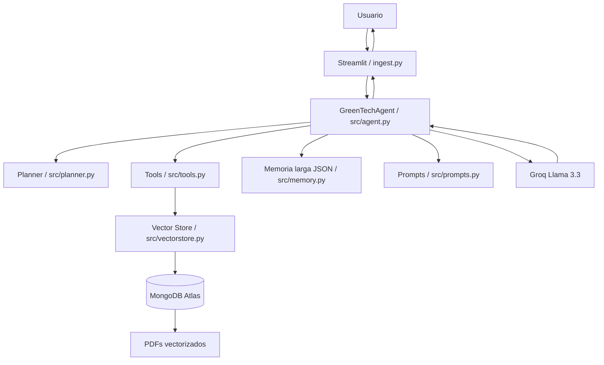

# Diagrma de orquestacion
Este diagrama muestra como se comunican los componentes del Mentor IA GreenTech.

## Explicacion breve
1. El usuario escribe en Streamlit.
2. Streamlit envia la pregunta al agente.
3. El agente pide un plan al planner.
4. Si necesita documentos, usa tools y vectorstore.
5. MongoDB deveulve fragmnentos de los pdf.
6. El agente arma el prompt.
7. Groq genera la respuesta.
8. La respuesta vuelve al usuairo.