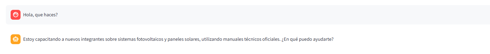
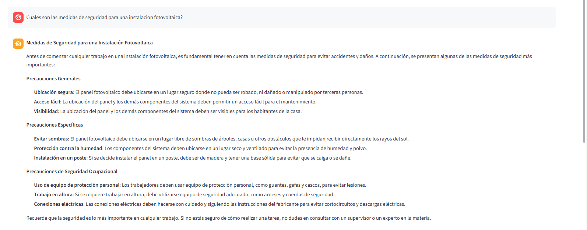
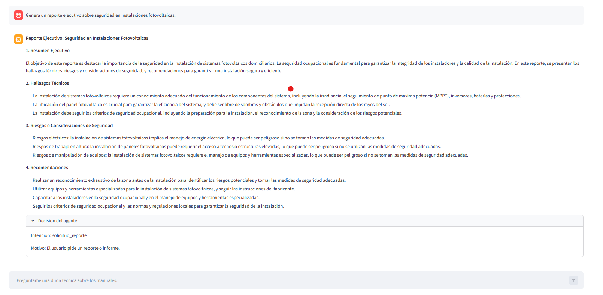

# Evidencia de pruebas

Estas pruebas se hicieron ejecutando la aplicacion con:

```powershell
streamlit run ingest.py
```

Antes se cargaron los PDF con:

```powershell
.\venv\Scripts\python.exe load_pdfs.py --reset
```

## Prueba 1: pregunta simple

Pregunta usada:

```text
Hola, que haces?
```

Resultado esperado:

```text
El agente responde...
```



```text
El agente responde de forma breve explicando que es un mentor IA de GreenTech.
```

Componentes usados:

- Planner
- Memoria corta
- LLM

Intencion esperada:

```text
consulta_simple
```


## Prueba 2: pregunta tecnica con documentos

Pregunta usada:

```text
Cuales son las medidas de seguridad para una instalacion fotovoltaica?
```

Resultado esperado:

```text
El agente responde...
```


```text
El agente busca informacion en MongoDB Atlas y responde usando fragmentos de los PDF.
```

Componentes usados:

- Planner
- search_documents_tool
- MongoDB Atlas Vector Search
- Prompts
- LLM
- Memoria corta y larga

Intencion esperada:

```text
consulta_tecnica
```

## Prueba 3: solicitud de reporte

Pregunta usada:

```text
Genera un reporte ejecutivo sobre seguridad en instalaciones fotovoltaicas.
```

Resultado esperado:

```text
El agente responde...
```


```text
El agente genera un reporte con resumen ejecutivo, hallazgos tecnicos, riesgos y recomendaciones.
```

Componentes usados:

- Planner
- generate_report_tool
- search_documents_tool
- MongoDB Atlas Vector Search
- LLM
- Memoria

Intencion esperada:

```text
solicitud_reporte
```

## Resultado general

Las pruebas muestran que el agente puede responder preguntas simples, recuperar
contexto tecnico desde documentos y generar reportes.


## Prueba 4 pytest

Se ejecutaron con: 

```powershell
.\venv\Scripts\python.exe -m pytest
```

```text
platform win32 -- Python 3.12.10, pytest-9.0.3, pluggy-1.6.0
rootdir: M:\GreenTech_Project
plugins: anyio-4.13.0, langsmith-0.7.33
collected 4 items                                                                                                                                                                                                                                                        

tests\test_agent.py ....                                                                                                                                                                                                                                        [100%]
=========================================================================================================================== 4 passed in 0.02s ===========================================================================================================================
```