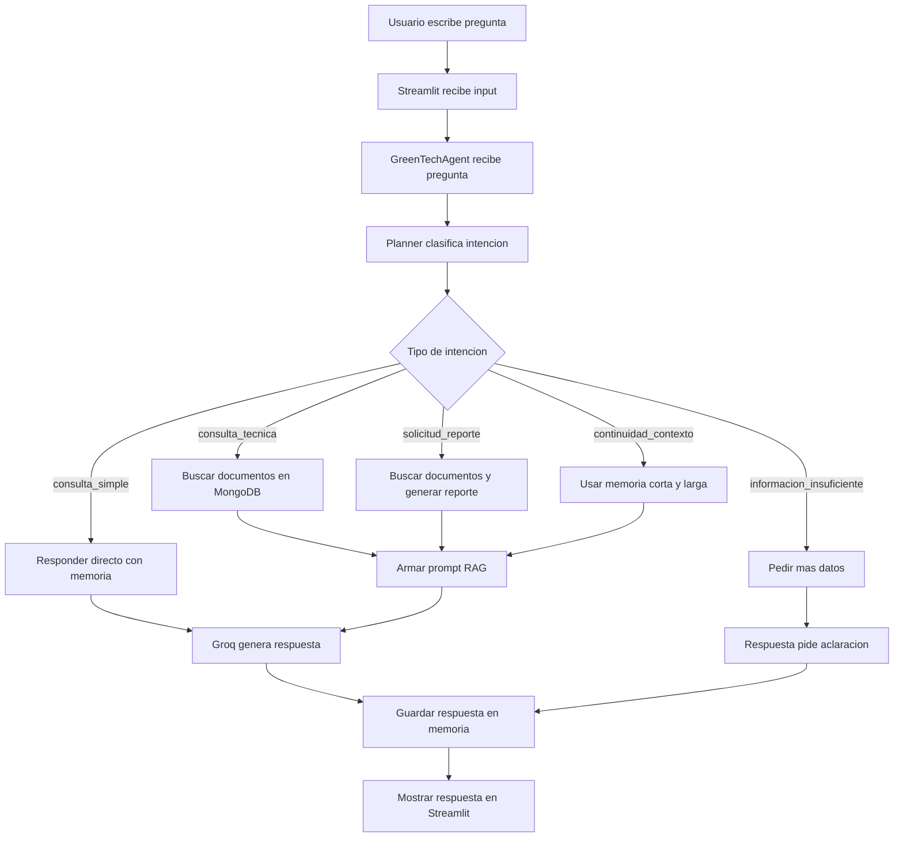

# Flujo de trabajo del agente
Este flujo muestra que ocurre desde que el usuario escrbire una pregunta hasta que recibe respuesta.

## Explicacion

1. El suaurio escribre una pregunta.
2. Streamlit envia la pregunta al agente.
3. El agente usa el planner para detectar la intencion.
4. SEgun l aintencion, decide si usa documentos, memoria o reporte.
5. Si usa cdocumentos, busca contexto en MongoDB Atlas.
6. El Agente arma el rpompt.
7. Groq genera la respuesta.
8. La respuesta se guarda en memoria y se muestra al usuario